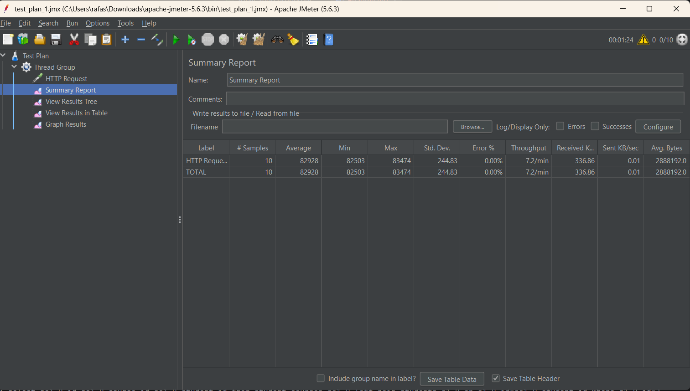
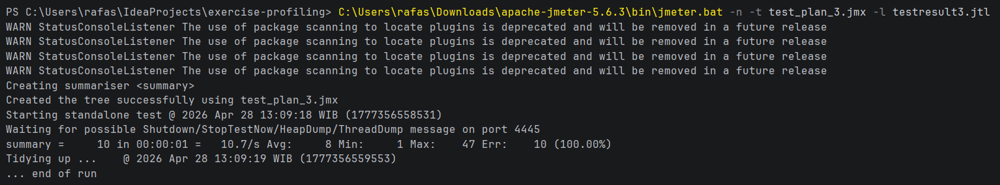
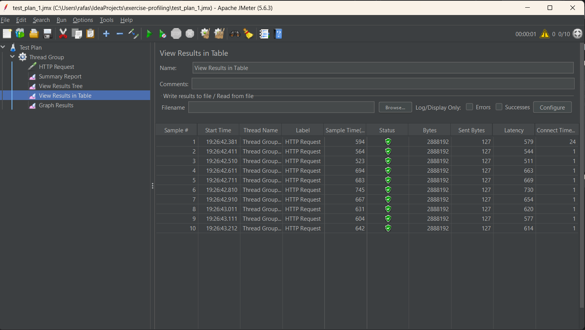
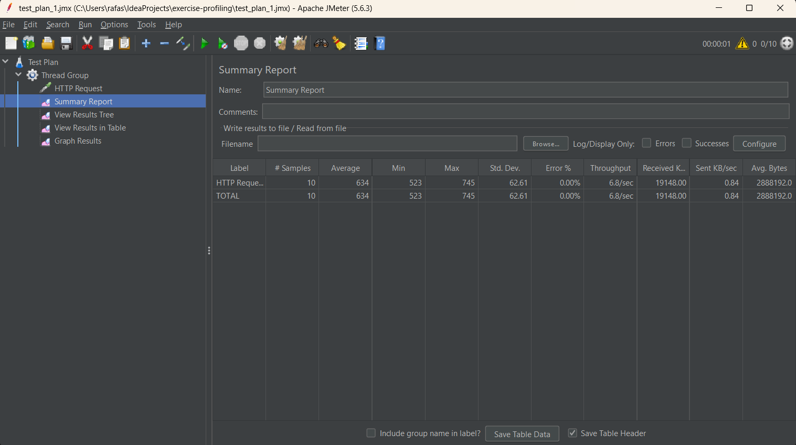
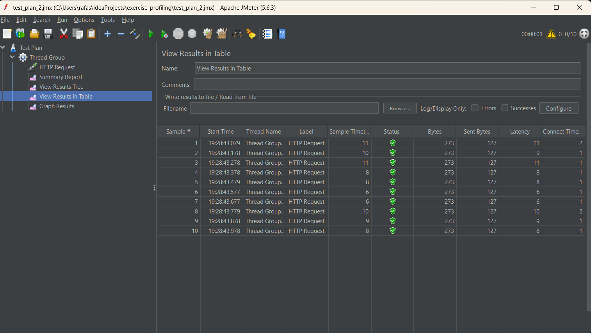
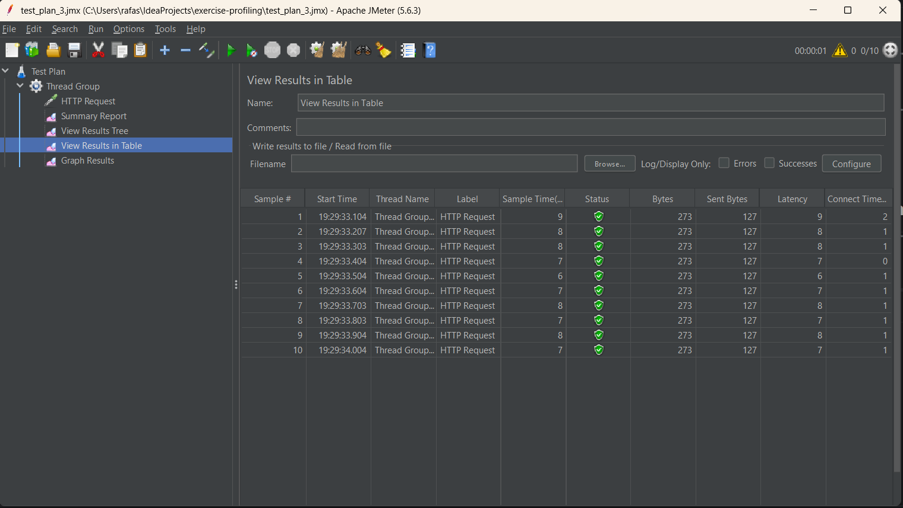
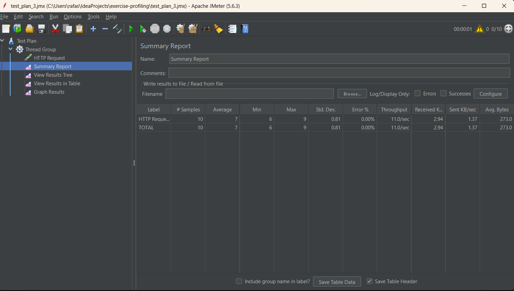
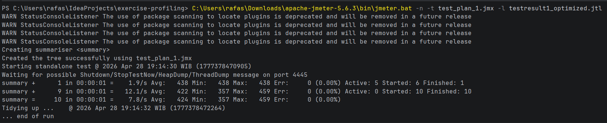
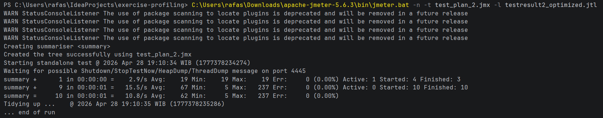
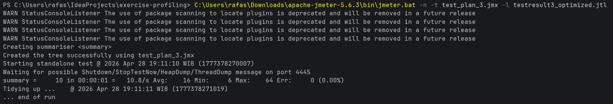

# Before Optimization
## GUI Endpoint /all-student

## GUI Endpoint /all-student-name

## GUI Endpoint /highest-gpa

## CLI Endpoint /all-student

## CLI Endpoint /all-student-name

## CLI Endpoint /highest-gpa

# After Optimization
## GUI Endpoint /all-student

## GUI Endpoint /all-student-name

## GUI Endpoint /highest-gpa

## CLI Endpoint /all-student

## CLI Endpoint /all-student-name

## CLI Endpoint /highest-gpa

# Conclusion
Based on the JMeter performance testing before and after the code refactoring, there is a massive improvement in application performance, specifically in execution time and resource consumption.

* **`/all-student-name`**: The original implementation used string concatenation (`+=`) inside a loop, which creates a new `String` object in memory on every iteration (O(N²) complexity) and causes high CPU spikes due to Garbage Collection. By refactoring the code to use Java Streams and `Collectors.joining()`, we utilized a mutable buffer (`StringBuilder` under the hood), changing the operation to O(N) and drastically reducing the average processing time.
* **`/highest-gpa`**: The original implementation loaded all 20,000 student records from the database into the application's memory just to find the one with the highest GPA. This caused immense memory exhaustion and network lag. By refactoring the repository to use `findFirstByOrderByGpaDesc()`, we delegated the sorting and limiting work directly to PostgreSQL. This shifted a heavy O(N) Java operation to a highly optimized O(1) database fetch, resulting in a significantly lower response time.
* **`/all-student`**: Refactoring the nested database calls inside loops into more efficient data retrieval strategies drastically reduced the number of queries executed against the database (solving the N+1 query problem), directly lowering the time the thread spent waiting for database I/O.

---

# Reflection

**1. What is the difference between the approach of performance testing with JMeter and profiling with IntelliJ Profiler in the context of optimizing application performance?**
JMeter provides a macro-level, end-to-end view of application performance. It simulates real-world load (multiple concurrent users) and measures external metrics like throughput, latency, and error rates. IntelliJ Profiler provides a micro-level, internal view. It hooks into the JVM to monitor memory allocation, CPU cycles, and thread states, allowing developers to see exactly which specific methods or lines of code are causing the slowdowns identified by JMeter.

**2. How does the profiling process help you in identifying and understanding the weak points in your application?**
Profiling removes the need for guessing. By utilizing Flame Graphs and Method Lists (Total Time vs. CPU Time), the profiler visually highlights the exact methods consuming the most resources. It allowed me to see that time wasn't just being spent querying the database, but in inefficient Java-level operations like string concatenation and object mapping.

**3. Do you think IntelliJ Profiler is effective in assisting you to analyze and identify bottlenecks in your application code?**
Yes, it is highly effective. The ability to record a specific time window while hitting an endpoint, and then immediately inspect the call tree and CPU samples, made it straightforward to trace the root cause of performance dips down to the exact class and method (e.g., locating the bottleneck inside `StudentService`).

**4. What are the main challenges you face when conducting performance testing and profiling, and how do you overcome these challenges?**
One major challenge is ensuring the measurements are accurate and not skewed by JVM warmup phases (JIT compilation) or background OS tasks. I overcame this by sending several "warmup" requests to the endpoints before starting the actual JMeter test plan or IntelliJ Profiler recording, ensuring the code was fully compiled to native machine code first.

**5. What are the main benefits you gain from using IntelliJ Profiler for profiling your application code?**
The main benefit is actionable data. Instead of randomly rewriting code and hoping it runs faster, the profiler tells me exactly where the CPU is spending its time. The integration directly into the IDE also means I can jump straight from the bottleneck in the profiling report to the source code with one click.

**6. How do you handle situations where the results from profiling with IntelliJ Profiler are not entirely consistent with findings from performance testing using JMeter?**
If JMeter shows high latency but the IntelliJ Profiler shows low CPU execution time for my methods, it usually indicates that the bottleneck is outside of the application's processing power. I would look into network latency, database query execution time (which might require a database-level profiler like `EXPLAIN ANALYZE`), or thread-blocking issues where the application is waiting on external I/O rather than actively computing.

**7. What strategies do you implement in optimizing application code after analyzing results from performance testing and profiling? How do you ensure the changes you make do not affect the application's functionality?**
My strategy focuses on algorithmic complexity and delegating work to the right tools (e.g., letting PostgreSQL do the sorting instead of Java, and preventing memory churn with `StringBuilder`). To ensure functionality remains intact, the primary defense is writing comprehensive Unit and Integration tests. Before refactoring, the tests should pass. After applying the optimizations, running the tests again guarantees that the internal mechanics changed, but the output remained exactly the same.